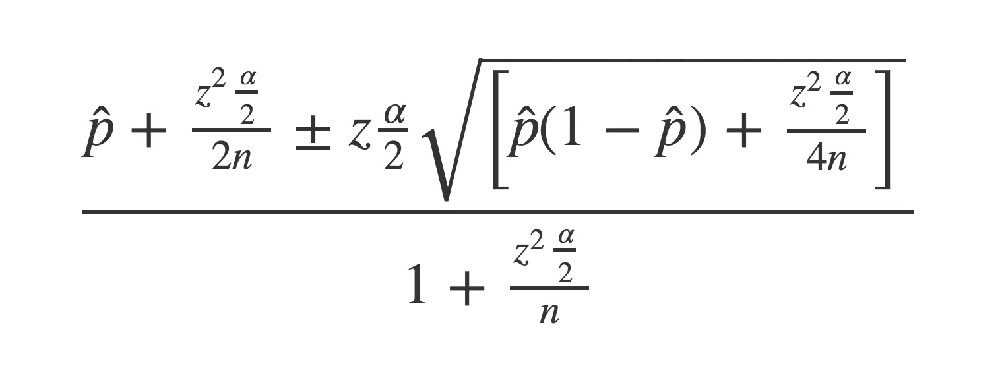
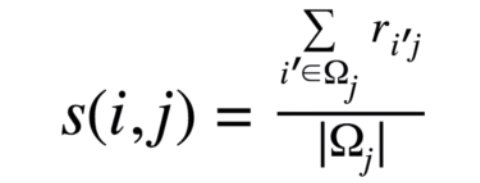
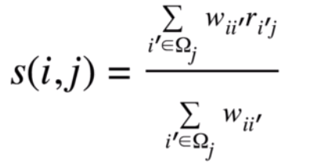
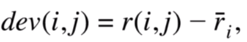
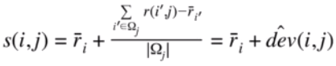
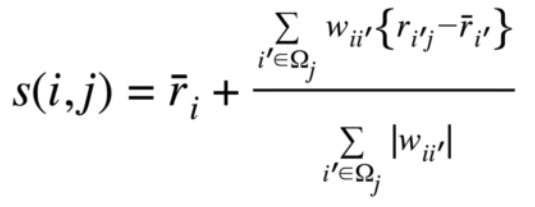
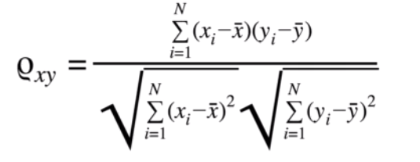
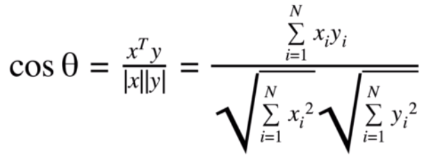

# recommendation_system

---

# Product Recommendation System

## Problem Statement: Personalized Product Recommendations

The goal is to elevate user satisfaction through the incorporation of a tailored product ranking mechanism. This objective involves creating an algorithm or model capable of producing precise and pertinent product rankings personalized for each user. This ranking approach takes into account various elements including user inclinations, previous engagements, product demand, and user resemblance. Its capability to foresee the most fitting products for a user, founded on their distinct attributes and preferences, is a fundamental requirement.

(refer to the end of document for a demo)
## Breaking down the problem statement

At this point we have understood that there are two entities from a broader perspective.

- product or item
- user

## User

### User is someone who will

- buy the products
- explore the products
- rate the products
- review the products

The above functions can be useful to train our model

From the perspective of an Ecommerce platform the user can interact with the product in the following way

- purchase
- add to cart
- add to wishlist
- review (spend time reading the details and reviews)
- rate (1 stars to 5 stars)
- refer the product to someone else

Each of the above attribute will be used later on

### What defines a user?

We can define a user by the following parameters

- name
- email
- location
- region
- occupation
- gender
- age
- annual income
- relationship status
  Each of the above attribute can define a users purchase decision alongside many others but for the sake of this project we will consider these attributes only

Based on the interaction of user with the products we can have further information as well

- purchase history
- rating history
- review history

These will play a key role in determining personalized recommendation for a user

## Product

### What is a product?

A product can be defined using

- title
- description
- tags
- category
- price

And much more but for the sake of simplicity we will continue with the above mentionsed attributes

### A User's interaction with a product

- buy
- add to cart
- add to wish list
- rate

Now that we have cleary defined our attributes for each entity lets analyze how can we recommend a product to users

Before getting into Personalized Recommendation lets have a brief look into non personalized recommendation

## Non personalized Recommendation (Useful for new users/when we dont have enough data)

- Based on popularity
- Based on Rating
- Context Classification

Based on popularity we can calculate the popularity score of each item, some popular scoring algorithms

- Hacker news Algorithm
- Reddit Algorithm
- Google's page ranking using NLP
- Wilson Interval

In this project I have used Wilson's Interval
Wilson score is a method of estimating the population probability from a sample probability when the probability follows the binomial distribution. As a result, we get a range of probabilities with an expected confidence interval.

Refer to [Wilson Interpretation](wilson.py) for implementation in python

Now this gives us a starting point.

For new users we don't have data to show them personalized recommendations. But we can extend this Scoring algorithm by applying a supervised machine learning algorithm on top of it using the user attributes that are required during a sign up process.
i.e. `name, email, location, region, occupation, gender, age, annual income ,relationship status`

We can apply random forest classification model to determine the probability of a user purchasing that product.
Refer ro [Random Forest](random_forest.ipynb) for implementation
Here to demonstrate I have used a data set consisting of
Age and Income to predict the likelihood of purchasing.
Combining it with the wilson scoring we can get a robust model to recommend products to the new users

## Personalized Recommendation

### Types of recommender system
1. Popularity based systems :- It works by recommeding items viewed and purchased by most people and are rated high.It is not a personalized recommendation.
2. Classification model based:- It works by understanding the features of the user and applying the classification algorithm to decide whether the user is interested or not in the prodcut.
3. Content based recommedations:- It is based on the information on the contents of the item rather than on the user opinions.The main idea is if the user likes an item then he or she will like the "other" similar item.
4. Collaberative Filtering:- It is based on assumption that people like things similar to other things they like, and things that are liked by other people with similar taste. it is mainly of two types: 
    - User-User 
    - Item -Item

Hybrid Approaches:- This system approach is to combine collaborative filtering, content-based filtering, and other approaches.

In this application I have used a hybrid approach.

## Note about the dataset
I couldn't find an extensive dataset with users and their attributes, items and their attributes and dataset with their correlation with users and vice versa for a variety of products. So to demonstrate the working of the application and the various machine learning algorithms at scale I have used different sets of data which closely resemble a ecommerce product and user realtionship to demonstrate working of the model. 

### Collaborative Filtering

I have implemented a collaborative filtering algorithm in this project
Whenever a user with past purchase history logs in to the app we can use this algorithm to start off.
It is based on the idea that if two users A and B have a similar taste. And A has bought an item I it is highly likely that B will also buy the same item.
This approach is called user user based collaborative filtering.

  | User/Products | Product 2 | Product 3 | Product 4 | Product 5 | Product 5 |
  |---------------|-----------|-----------|-----------|-----------|-----------|
  | A             | Y         | N         | Y         | N         | Y         | 
  | B             | Y         | N         |           | N         | N         |
  | C             | N         | Y         | Y         | Y         | Y         |
  | D             | Y         |           | Y         | N         | Y         |
  | E             | N         | Y         |           | Y         |           |

The above table represents whether a user liked a particular item or not. `Y = yes`, `N = No`, Empty space means not yet seen
Based on the table we can say that user `A` and user `D` have a similar taste and we can easily recommend `Product 3` to `D`

We can replace the Y and N values by ratings thus turning it into a rating matrix

  | User/Products | Product 2 | Product 3 | Product 4 | Product 5 | Product 5 |
  |---------------|-----------|-----------|-----------|-----------|-----------|
  | A             | 5         | 2.5       | 4         | 1         | 4         | 
  | B             | 4         | 2         |           | 3         | 2         |
  | C             | 2         | 4         | 4         | 4         | 4         |
  | D             | 5         |           | 5         | 3         | 5         |
  | E             | 1         | 3         |           | 4         |           |

Now using this table we can calculate the rating of the missing items to predict whether the user will be willing to purchase the product. The following things are kept in mind while designing a collaborative filter in mind.
- Each users' similarity with a user (say Elon) will affect Elon's predicted rating. The similarity between two user is quantized using `pearson coefficient`. The similarity will be assigned a weight. Which will impact the distribution. A higher weight implies user A's rating will highly affect Elon's predicted rating. A smaller weight implies user A's rating will not impact Elon's predicted rating by large
- People can be optimistic or pessimistic. A user might consider 3 star as a good product while Elon may consider it as very bad. To counter this issue we calculate all the Elon's average rating and calculate its deviation instead of straight probability

### Average rating

### Weighted Average

### Deviation

### Rating including deviation

### Combining weight and deviation

### Calculating weights (Pearson coefficient)

The above table explains the case of user user filtering. Whilst another approach could be item item based filtering. That is items are assigned to the users.

In a way it can be thought of as assigning an item to a user such that he/she will give it more rating. Which mathematically is just taking the transverse of the original rating matrix and assigning values to it.

### Important point to note
1. Item item based filtering works faster than user user based filtering because the algorithm runs in O(row * row * column)
Since the number of users can be very large than the number of products. (row = users in user-user and row = items in item-item)
2. However user user based approach can be more accurate.
3. For this app I have used item - item based approach to reduce latency. A user user based implementation is also available in the repository
4. Using K nearest neighbours as the item size is still very large to process all

You can refer to 
1. [item-item](item_based.py)
2. [user-user](user_user_based.py)

## Cosine Similarity
Now once a user clicks a product and starts to explore the product. Based on the items attributes I can suggest some more similar items using cosine similarity matrix. Refer to [cosine similarity](preprocess_movie_rating.py).

## User interactions
To further strengthen the system activities such as
- hovering a product card
- visiting a product page + time spent
- added to cart 
- added to wishlist
- purchased

can be taken into account.

Adding to wishlist, Adding to cart and purchasing represented on a scale of 1 to 3. To demonstrate as will to purchase the product.
Activities such as hovering and visiting product page represents the willingness of buying

## The client side of the application
1. I have used jinja2, html, css and js to build the client side of the application.
2. For the backend I have used flask. Refer to [app](app.py).

Thank you for reading thus far.
You can see the app live in action in the [video](https://drive.google.com/file/d/1yeicD9mu1_K0iCl-yO7c0DO4p_dmhdvI/view?usp=sharing)

To run the app on your device
1. pip install pandas numpy sklearn 
2. Sequentially run all the python scripts as mentioned in the [sequence](sequence.txt) 